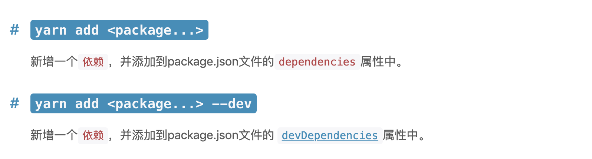

## `wui`组件库
### 项目搭建
* 建立`webpack.config.js`来配置`webpack`
* 通过`awesome-typescript-loader`来解析`ts`文件
* 建立`webpack.config.dev.js`和`webpack.config.prod.js`来配置不同环境下的`webpack`配置

`yarn`安装依赖时的依赖环境设置： 


### `Icon`组件
* 通过`interface`来校验组件传入的参数
* `require.context`方法来导入所有的`svg`文件
* 使`Icon`组件支持所有的`svg`原生属性：  
  1. `interface extends React.SVGAttributes<SVGElement>`: 接口继承所有的`svg`原生属性
  2. `{...restProps}`来进行所有属性扩展： 注意这里的{}只是表示里边的内容是`js`语法，而并不是表示对象
  3. 定义`classes`函数来拼接传入的类名，实现`className`多类名书写
### `Icon`组件测试
* `importAllSvg`文件中使用`try catch`,因为文件中的代码在测试环境执行会报错(编写可测试的代码)
* `jest`测试时，如果有非`js`文件，需要通过`moduleNameMapper`来进行配置对应得文件来进行`mock`,对应代码参考`test/__mocks__`目录下的文件
* 生成测试快照，可以通过肉眼来观察生成的`DOM`结构是否符合要求，对于简单组件来说比较好用

### `Dialog`组件
* `scopeClass`的封装思路
* `close`中的`Icon`为什么会受到`line-height`的影响
* 有些文件为什么要加`_`
* 在出现模态框后并进行上下滑动，划出后会出现白色区域

### `React Class`书写方式
* `constructor`的写法复习
* 绑定事件时`this`指向修改：  
  1. 在`jsx`中绑定时： `this.onClick.bind(this)`
  2. 提前在`constructor`中进行绑定： `this.onClick = this.onClick.bind(this)`
  3. 通过箭头函数定义函数：  
      ```js
      onClick = () => {console.log(this)}
      // 相当于如下代码
      constructor() {
         super()
         this.onClick = () => console.log(this)
      }
      ```
* `React class`写法中的计算属性: [存值函数(`getter`)和取值函数(`setter`)](https://es6.ruanyifeng.com/#docs/class#%E5%8F%96%E5%80%BC%E5%87%BD%E6%95%B0%EF%BC%88getter%EF%BC%89%E5%92%8C%E5%AD%98%E5%80%BC%E5%87%BD%E6%95%B0%EF%BC%88setter%EF%BC%89)
  ```js
   get name() {
      return `${firstName}${lastName}`
   }
  ```
* `dispalyName`属性的用法：  
  ```js
  // 添加一个显示的名字，方便在调试工具中查看
  static displayName = 'xxx'
  ```

### 问题记录
#### `scss`代码的书写以及层级问题：  
```scss
.wui-input {
  position: relative;
  &-prefix {
    position: absolute;
    left: 0;
    top: 50%;
    transform: translateY(-50%);
  }
  .wui-input-prefix {
    position: absolute;
    left: 0;
    top: 50%;
    transform: translateY(-50%);
  }
}
```
最终编译效果：  
```css
.wui-input {
  position: relative;
}
.wui-input-prefix {
  position: absolute;
  left: 0;
  top: 50%;
  transform: translateY(-50%);
}
.wui-input .wui-input-prefix {
  position: absolute;
  left: 0;
  top: 50%;
  transform: translateY(-50%);
}
```
如果要使用`&`来进行省略代码的话，一定要注意编译后的嵌套结构和层级问题。

处理`css`层级问题需要点击浏览器对应的样式源码位置，查看最终的编译效果更容易理解

#### [`CSS`通用兄弟选择器](https://developer.mozilla.org/zh-CN/docs/Web/CSS/General_sibling_combinator)
  
兄弟选择符，位置无需紧邻，只需同级，`A~B`选择`A`元素**之后**所有同层级`B`元素
> 要注意只能选择之后的兄弟元素，而不是任意位置

代码示例：  
```html
<span>This is not red.</span>
<p>Here is a paragraph.</p>
<code>Here is some code.</code>
<span>And here is a span.</span>
```
```css
p ~ span {
  color: red;
}
```  
只有最后一个`span`标签的字体颜色会变红。

### `git`相关知识

#### `git push`

`git push`命令的语法：  
```text
git push <远程主机名> <本地分支名>:<远程分支名>
```

* 分支推送顺序的写法： <来源地>:<目的地>
* 如果省略远程分支名，则将本地分支推送至与之存在追踪关系的远程分支，如果该分支不存在，则会被新建
```shell script
# 将本地的master分支推送到origin主机的master分支，如果origin主机的master分支不存在，则会被新建
# git push <远程主机名:origin> <来源地:master>:<目的地:master>
git push origin master
```
* 如果省略本地分支名，则表示删除指定的远程分支
```shell script
# 删除origin主机的master分支
git push origin :master
# 等同于
git push origin --delete master
```
* 使用`-u`选项指定一个默认主机
```shell script
# 将本地的master分支推送到origin主机的master分支，同时指定origin为默认主机
git push -u origin master
```
* 如果当前分支只有一个追踪分支，那么主机名也可以省略
```shell script
# 推送当前分支到默认主机
git push
```
* 强制推送，会导致远程主机上更新的版本被覆盖
```shell script
git push --force origin
# 简写
git push -f origin
```
* 推送标签(`tag`)到远程仓库
```shell script
git push origin --tags
```

综合以上知识点，下面这段代码的含义如下：  


强制将本地`master`分支推送到`git@github.com:wangkaiwd/wui.git`的`gh-pages`分支。

### 发布到`npm`
项目中使用`yarn`进行代码的发布，[官方文档](https://yarnpkg.com/lang/en/docs/publishing-a-package/#)

在发布前需要修改`webpack`的配置以及`package.json`的配置,接下来我们分别介绍配置的改动项

* `webpack`
由于我们的项目要分享给其它开发者使用，是一个库文件，所以在出口项中要添加`targetLibrary`选项：  
```js
output: {
  filename: '[name].js',
  libraryTarget: 'umd',
  library: 'WUI'
}
```

* `package.json`

在`package.json`中我们要有以下几项： 
* `main.js`: 项目的入口文件，可以通过直接引用目录来使用依赖
* `files`: `npm`中需要上传的文件，不设置会将项目中除`.gitignore`忽略的文件都上传到`npm`中，设置之后只会将设置的内容，以及`license`、`readme.md`、`package.json`上传到`npm`中
* `types`: 在写`TypeScript`的项目中会用到，告诉我们类型声明文件的位置

当准备工作做好之后，我们开始进行发布工作：  
* 首先去`npm`官网注册账号
* 执行`yarn login`登录自己注册的账号
* 执行`yarn publish`,第一次执行的话需要输入密码，之后就不用了。每次执行都需要指定版本号，有点烦

这里如果没有错误信息就会上传成功了，其它开发者可以直接`yarn add`然后在项目中使用。
